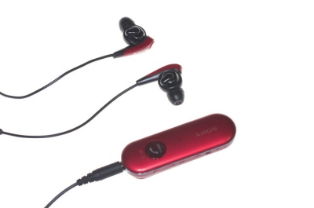
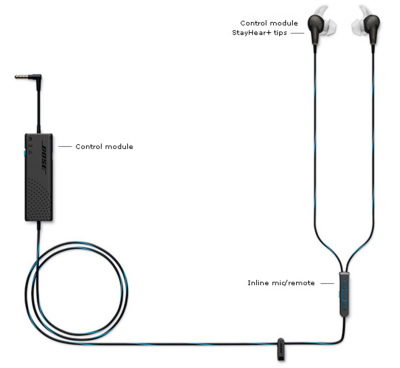
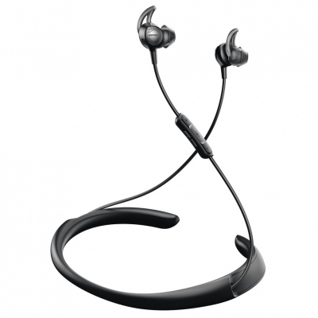
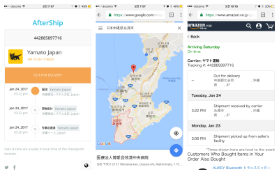

### BOSE QC30 구입기

40만원을 호가했던 [젠하이져 모멘텀 헤드폰](http://goldenears.net/board/UR_Headphones/3920834)을 구입한지 꽤 시간이 흘렀다. 
회사 생활하면서 나름 잘 썼으나 이직을 하게 되면서 대중교통을 타게 되는 시간이 많아지고,
더욱이 여름에는 오버이어 헤드폰이 너무 거추장스럽고 답답해서 잘 사용하지 않게 되었다.
그러다보니 자연스레 [노이즈캔슬링](http://thegear.co.kr/10653)이 적용된 이어폰이 갖고 싶었다.

#### Sony NC31

먼저 고려하게 되었던 것은 소니에서 나온 nc31 모델이다. 
껌통이 존재하긴 하지만 무선이기 때문에 클립을 사용하는 정도는 많이 불편할 것 같지 않았다.
무엇보다도 가장 큰 장점은 10만원 안쪽으로 맛 볼 수 있는 노이즈캔슬링, 역시 가격 메리트가 컸다.
단점으로 생각된 것은 언제나 구매시점의 기대치를 채워주지 못했던 소니제품군에 대한 이미지.
살 때는 엄청 좋은 것 같아서 샀는데, 집에 와서 보면 항상 실망했더라는... 근데 다음에 또 사게 되는 마력-ㅁ-

#### Bose QC20

역시 노이즈캔슬링하면 보스를 빼놓을 수 없다. 
사실 노이즈캔슬링에서는 역사적인 이유로 보스를 이길만한 곳이 없다고 들었다.
심지어 코스트코에서 시착해봤던 보스 노캔 헤드폰의 느낌이 너무 좋았었다.
그렇지만 40만원급의 비싼 가격... (생각해보면 [B&O A8](http://shopping.naver.com/detail/detail.nhn?nv_mid=5624997177&cat_id=50001976&frm=&query=b%26o+a8)은 오히려 저렴한 이어폰이다)
그리고 유선에 소니 것에 비하면 너무나도 거대한 저 껌통은 어쩔...
하지만 가격이 30만원 안쪽으로 되면 사겠다고 벼르기 시작하였다.
그러다가 2016년 블랙프라이데이, 아마존에서 199불에 팔기 시작했다.
30만원 많이 안쪽인데다가 무관세범위... 근데 오히려 싸지니까, 더 윗모델을 보게 되는 사람의 간사함.

#### Bose QC30

사실 QC20을 보면서 느꼈던 단점들을 싹 보강해서 신제품이 나왔다. 무선에다가 껌통도 사라졌다.
물론 약간은 거추장스러워보이는 넥밴드이지만, 그래도 저게 어디야 싶었다.
사실 299불이라는 가격을 제외하면 딱히 단점이 없었다.
[클리앙의 반응](http://www.clien.net/cs2/bbs/board.php?bo_table=news&wr_id=2177090)을 보면
대체적으로 우호적인 반응이다.
이제 가격만 좀 싸지면 괜찮을 것 같았...(지만, qc20의 경우에도 qc30 출시 직전을 제외하면 할인이 없었다)

#### 1차 구입실패

오키나와에 갈 일이 생겼다. 이번 기회에 일본에서 구매해서 오는 것도 좋을 것 같았다.
오키나와에는 빅카메라와 같은 샵이 있는지 없는지, 또 굳이 여행가서 찾아다니기도 그렇고 해서
[아마존 재팬](https://www.amazon.co.jp/Bose-QuietControl-wireless-headphones-コントローラブル-ノイズキャンセレーション機能/dp/B01G16PY2A/ref=sr_1_1?ie=UTF8&qid=1486050396&sr=8-1&keywords=qc30)에서 주문하기로 했다.
근데 언제나 도지는 귀차니즘에 미루고 미루다가 호텔에 도착하고 첫날밤에 주문하게 되었다.
3박 4일 일정이었는데, 본섬이 아니다보니 좀 일정이 빠듯할 것 같았다.
실제로도 배송 예정시간이 7일쯤 나왔던 것 같다.
아마존재팬과 야마토 택배사에 메일을 한참 주고 받았던 것 같다.
분명 받을 수 있을 거라 생각했는데, 12시에 체크아웃할 때까지 도착하지 않았다. (오후 5시 배송완료로 표시ㅠ.ㅠ)
친절한 아마존 덕에 무료로 반품처리할 수 있었기에 망정이지 굉장히 곤란할 뻔 했다.

#### 구입성공

아마존재팬에서 사려고 했던 가격이 34560엔이었다. 환율에 카드수수료까지 하니 대략 36만원정도 나왔다.
그런데 중고나라에 일본에서 직공수해온 미개봉품을 40만원 선에서 팔고 있었다.
그러다가 38만원에 파는 사람이 있길래, 나는 36만원에 사려고 했었기 때문에 2만원 정도 더 얹어서 사도 좋겠다고 생각했다.
구매했더니 AS을 위해 꼼꼼하게 서류까지 정리해주었다.
그런데 구매 영수증을 봤더니 29900엔.
판매가가 32000엔인데, 빅카메라 할인쿠폰 7% 적용되어 29900엔이었다.
게다가 모르긴 몰라도 택스 리펀 받아서 소비세 8%도 돌려받지 않았을까?
대략 판매자입장에서는 27~8만원정도에 구매한 모양이다.
10만원이나 웃돈이 붙은 느낌이지만 위에서 봤던 아마존 재팬에서 사려던 가격 대비 2만원 정도 더 준거라 만족한다.

#### AS

보스는 월드워런티가 적용된다. 국내 정판 가격이 너무 사악한 편인데...(QC20 기준 299불이었는데, 국내판은 거의 50만원 수준)
대부분 그렇지만, 이런 케이스에는 국내총판 요청으로 아마존, 공홈 등에서는 한국으로 배송을 해주지 않는다.
그래서 사실상 월드워런티가 적용된다하더라도 온라인으로 구매한 경우에는 좀 어렵다고 봐야한다.
정식 판매처로 인정해주는 곳은 국제배송을 하지 않고, 국제배송을 하는 곳은 정식 판매처로 인정되지 않기 때문이다.
대신 해외에서 직접 사오는 경우, 정식 판매처 영수증과 출입국기록을 증빙할 수 있으면 국내에서 정식 AS를 지원해준다.
구입후 1년간 문제가 발생하면, 새상품으로 교환을 해준다.

#### 간단사용기

일단, 집에서 써봐서 노이즈캔슬링이 얼마나 되는지 잘모르겠다. 좀 조용해지는 것 같긴한데, 역시나 대중교통을 이용해봐야 느낄 수 있을 듯.
다만 노이즈캔슬링을 끌 수는 없는 모양이다. 음악을 듣지 않을 때도 띠~하는 화이트 노이즈가 좀 생긴다.
그리고 이건 좀 생각도 못한 건데, 노이즈캔슬링 기능을 줄이면... 노캔이 줄어드는 게 아니라 노이즈를 체크하는 마이크에서 받은 소리를 이어폰에 출력시켜준다.
즉, 노캔이 줄어서 바깥 소리가 들린다기보다는 마이크로 얘기하는 듯한 느낌이 든다. 무게나 넥밴드 자체는 딱히 불편함을 느끼지는 못하겠다.
소음이 많은 곳이 아니라면 (즉, 실내라면) 헤드폰을 쓰는 것도 좋을 것 같다는 느낌이다. 젠하이저 모멘텀을 처분할까 했는데, 그냥 병용해야겠다 싶었다.
무선이나 노캔이나 다 좋지만, 헤드폰을 완전히 대체하기에는 좀 부족한 느낌이 든다.
