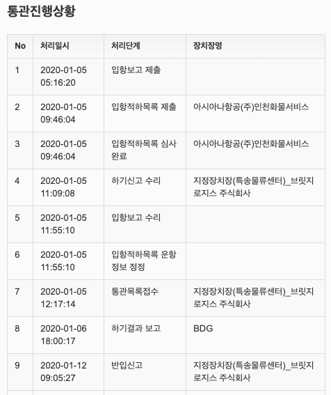
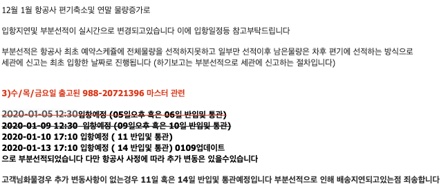

### 직구 BDG 하기결과 보고란?

직구시, 배대지 통해서 항공선적이 되었다고 결과에 나왔는데, 국내배송이 되지 않는 경우가 있다.

1주일 넘게 상태가 하기보고(BDG)에서 멈춘 상태로 아무런 변동이 없어서 이것저것 찾아보고, 고객센터에 문의도 남겼다.
혹시라도 운송중에 분실이 되었거나, 혹은 세관에서 통관 절차에 문제가 생긴 건 아닌가 해서...

내용인즉슨, 부분선적에 의해서 신고 리스트는 먼저 도착했는데, 물건이 아직 도착하지 않은 상태이다.
내 물건은 한 박스라서, 부분선적이 되지 않을 거라 생각했었는데, 
아마도 화물수송시에 리스트는 배대지에서 발송하는 전체 리스트를 사용하고, 실제 선적은 각각 화물 스케쥴에 따라서 별도로 되는 것 같다.

결론, 너무 조급해하지 않고 계속 기다리면 될것 같다. 문제가 생기면 '하기결과 이상보고'라고 별도의 상태값을 가진다고 한다.