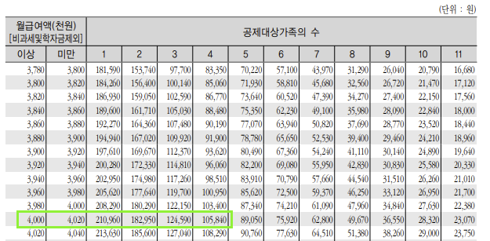
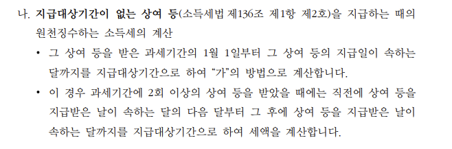
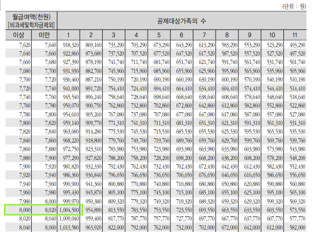

### 월급여에서 소득세(갑근세)를 부과하는 방식

월급을 받고나면, 이유를 모르는 여러 가지 공제들이 들어간다. 
예를 들어, 소득세, 지방소득세, 고용보험, 건강보험, 국민연금 등등.
그 중에 소득세가 어떻게 부과되고 있는지 찾아본 결과를 공유한다.

일단 국세청에서 배포한 `근로소득 간이세액표`[^1]라는 것이 있다.
그 자료에서 맞는 월급여 기준의 소득세를 원천징수한다.

단위가 `천원`이라서 조금 헷갈릴 수 있는데, 예를 들어서 보면 쉽다.
연봉이 4920만원인 직장인은, 월급여가 410만원이다.
보통 중식대 10만원은 비과세처리 되기 때문에 과세대상 월급여는 400만원이 된다.
그러면 `공제대상 가족의 수`가 1인 경우(본인)를 기본으로 해서 `210960원`의 소득세가 징수된다.
당연히 지방소득세는 소득세의 10%인 `21096원`이 징수된다.

회사마다 공제대상가족수(인적공제받을 수 있는 사람)를 사전에 신청하면, 원친징수금액이 그만큼 적어진다.
예를 들어, 위 케이스에서 결혼을 했고 외벌이이면서 자녀가 2명 있다고 가정하면, `105840원`이 소득세로 징수된다.
그러나 많은 회사에서는 기본공제 1명을 기준으로 원천징수를 처리하고, 연말정산으로 재계산하게 된다.
공제대상가족수를 사전에 설정하고 안하고는, 결국 소득세 원천징수세액 80%, 100%, 120%를 선택하는 것과 비슷한 효과가 있다.
결국, 먼저 내고 돌려받느냐, 적게 내고 적게 돌려받거나 추가징수하느냐의 차이?

추가로 상여금(인센티브)를 받았을 때는 어떻게 계산되는지도 알아보자.
여러 가지 종류의 상여금이 있지만, IT기업에서 주로 받는 연말상여금 기준으로는 `나`항에 속한다.

즉, (해당달 월급여 + 상여금) 구간에 맞는 세액 - (해당달 월급여에서 공제한 소득세) = (상여금 소득세) 로 계산된다.
보통 월급여가 높아질수록 세율이 높아지기 때문에 상여금까지 포함되면 세율구간이 높아지면서 상여금 소득세를 많이 내게 된다.

위에서 들었던 예시에서 상여금으로 400만원을 받았다고 가정하자.
그러면 해당달에 수령한 총급여는 800만원이 된다.

800만원에 해당하는 세액은 `1004500원`이다.
여기에서 월급여에서 이미 징수된 `210960원`을 제하면, `793540원`이 상여금의 소득세로 원천징수된다.
그래서 보통 상여금을 받으면 소득세를 어마어마하게 내게 되고, 세금으로 다 뜯겼다는 얘기를 하게 된다.

[^1]: https://www.nts.go.kr/inc/download.asp?file_url=/nts_data/info/%C1%B6%C8%B8/(18%B3%E22%BF%F9%20%BD%C3%C7%E0)%B1%D9%B7%CE%BC%D2%B5%E6%20%B0%A3%C0%CC%BC%BC%BE%D7%C7%A5.pdf&file_nm=(18%B3%E22%BF%F9%20%BD%C3%C7%E0)%B1%D9%B7%CE%BC%D2%B5%E6%20%B0%A3%C0%CC%BC%BC%BE%D7%C7%A5.pdf