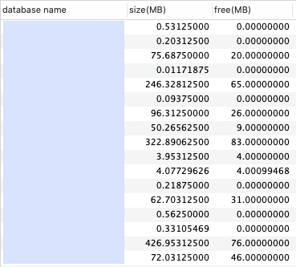
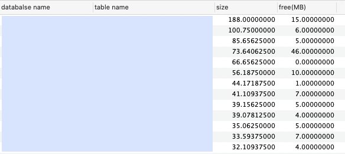

### MySQL 용량 확인

#### 데이터베이스별 용량 확인
```sql
select
    table_schema as "database name",
    sum(data_length + index_length) / 1024 / 1024 as "size(MB)",
    sum(data_free) / 1024 / 1024 as "free(MB)"
from
    information_schema.TABLES
group by
    table_schema;
```



#### 테이블별 용량 확인
```sql
select
	table_schema as "database name",
  	table_name as "table name",
    sum(data_length + index_length) / 1024 / 1024 as size,
   	sum(data_free) / 1024 / 1024 as "free(MB)"
from
	information_schema.TABLES
group by
	table_name
order by
	size desc;
```


#### 테이블 정보 확인
```sql
show table status;
select * from information_schema.TABLES;
```