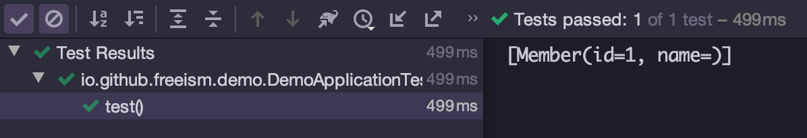
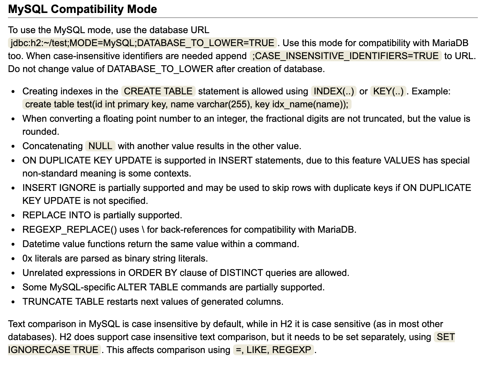
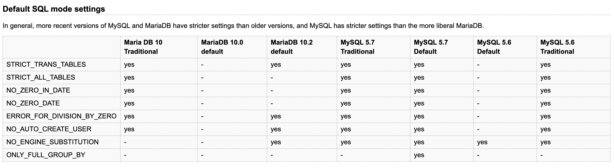
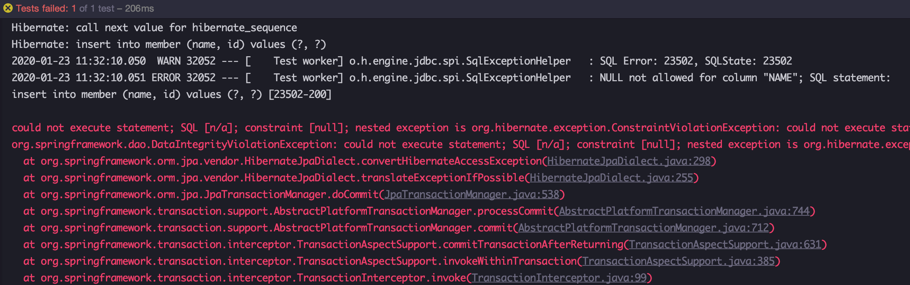

### H2 DB Not Null 컬럼에 Null을 insert하면 발생하는 일

일단 아무런 문제가 없는 간단한 Entity와 Repository를 만들고, application.yml에 h2 DB에 대한 정보를 적어둔다.

```java
@Data
@Entity
public class Member {
    @Id
    @GeneratedValue
    private Long id;

    @Column(nullable = false)
    private String name;
}
```

```java
public interface MemberRepository extends JpaRepository<Member, Long> {
}
```

```yml
spring:
  h2:
    console:
      enabled: true
  jpa:
    show-sql: true
  datasource:
    hikari:
      jdbc-url: jdbc:h2:mem:testdb;MODE=MySQL;  # MODE=MySQL이 굉장히 중요하다
```

그런 후에 아래 테스트를 실행시켜보자.

```java
@SpringBootTest
class DemoApplicationTests {
    @Autowired
    private MemberRepository memberRepository;

    @Test
    void test() {
        memberRepository.save(new Member());    // Entity의 값을 null로 insert함

        System.out.println(memberRepository.findAll());
    }
}
```

테스트가 성공하고, 결과값이 나온다. 



```bash
Hibernate: create table member (id bigint not null, name varchar(255) not null, primary key (id))
...
Hibernate: call next value for hibernate_sequence
Hibernate: insert into member (name, id) values (?, ?)
Hibernate: select member0_.id as id1_0_, member0_.name as name2_0_ from member member0_
[Member(id=1, name=)]
```

column은 `not null`로 선언되어 있었다. 그런데 null로 insert가 성공한 것이다.

없는 것이 없는 구글, 그리고 스택오버플로우를 검색하여 실마리를 찾았다.

> When inserting data, if a column is defined to be NOT NULL and NULL is inserted, then a 0 (or empty string, or the current timestamp for timestamp columns) value is used. Usually, this operation is not allowed and an exception is thrown. [^1]

그리고 h2 db의 mysql compatibility 문서를 찾아들어갔는데... [^2]



응? 분명 위의 스택오버플로우에는 인용문으로 사용했는데, 실제 문서에는 없는 내용이다.
오호라... 해당 스택오버플로우는 2016년꺼라서, 뭔가 그 사이에 바뀐 것 같은 냄새가 난다.

github 주소를 찾아서 들어갔다. (옛날 프로젝트여서인지, github을 찾기가 좀 어려웠다)

> This compatibility code was written a long time ago when MySQL was very different from others. 
MySQL got a STRICT mode that disables different legacy tricks. 
It was enabled by default some time ago: https://dev.mysql.com/doc/refman/5.7/en/sql-mode.html#sql-mode-strict 
There is no normal way to toggle convertInsertNullToZero in H2, only the whole MySQL compatibility mode can be enabled. And the MySQL compatibility mode is the only one user of that compatibility code. 
I'm not sure what to do with it. Because default behavior of MySQL was changed in 2015 we may want to remove this flag and all related code now for better compatibility with default behavior of modern versions. But somebody may still use this trick, of course.

> yeah, lets tracks the behaviour of the current stable version of MySQL, we're not aiming to be perfect with these other-database modes [^3]

내용인즉슨, mysql 호환모드는 개발한지 오래되었는데, 당시에는 mysql이 null을 zero/empty string으로 치환해서 넣는 동작을 했다고 한다. 지금은 그런 동작이 없어지긴 했는데, 과거 버전에 대한 호환성 문제가 있어서 바꿔야 할 지 확신이 없다고 했는데, 다른 컨트리뷰터가 현재 안정화 버전에 대한 내용으로 맞추자고 해서 수정되었다. [^4]

```java
@SpringBootTest
class DemoApplicationTests {
    @Autowired
    private MemberRepository memberRepository;

    @Test
    void test() {
        memberRepository.save(new Member());    // Entity의 값을 null로 insert함

        String result = memberRepository.findAll().get(0).getName();

        assertFalse(result == null);    // null이 아님
        assertTrue(result == "");   // empty string이 들어있음
    }
}
```

Mysql에 대해서 좀더 찾아봤더니, 5.6 버전까지는 `not null` 컬럼에 `null`이 입력되면, 0 또는 empty string으로 치환해서 넣는 동작이 있었는데, 5.7 버전부터 `strict mode`가 default 설정으로 바뀌면서 해당 기능이 optional하게 바꼈다는 것이다. [^5]



실제로 mysql 5.6 -> 5.7 가는 시기에는 하위호환성이 맞지 않아서 많은 문제가 있었던 것 같다. 어떻게하면 `strict mode`를 끌 수 있는지에 대한 많은 블로그[^6] 글이 검색되었다. 그리고 2016년 (버전이 바뀌던 시기)에 h2의 이슈에 `not null constraint`가 적절하게 동작하지 않는다는 이슈제기는, mysql이 원래 그렇게 동작하는 것으로 답변하고 종료처리 되었다.

> yes, this is MySQL compatibility behaviour, it is how MySQLworks, it converts NULL to zero on insert [^7]

어쩌되었거나, 최근에 h2 DB도 mysql strict mode를 default 동작으로 생각하고 로직이 수정되었다.

> Issue #1942: MySQL Mode: convertInsertNullToZero should be turned off by default?
Issue #1940: MySQL Mode: Modify column from NOT NULL to NULL syntax [^8]

그게 2019년 10월 14일에 배포된 `1.4.200` 버전이다. h2 DB는 테스트코드에서 많이 사용하고 있어서, springboot에서도 기본 지원하고 있다. 그렇다면 springboot에서는 적용이 되었을까 찾아보았다. 역시나 활발한 프로젝트는 반영도 빠르다.

> Upgrade to H2 1.4.200 #18724 [^9]

스프링부트에는 `2.2.1.RELEASE` 버전 그리고 `2.1.10.RELEASE` 버전에서 반영되었다. 최신버전의 스프링부트를 사용한다면, h2의 mysql 호환모드를 사용하더라도 `not null constraint`가 정상적으로 동작한다. 혹시 스프링부트 버전을 올리는 것이 부담스럽다면 `com.h2database:h2:1.4.200`으로 h2 버전만 `1.4.200` 이상으로 정의해도 괜찮다.



[^1]: https://stackoverflow.com/questions/20013154/h2-does-not-enforce-not-null-in-mysql-compatibility-mode
[^2]: http://www.h2database.com/html/features.html#compatibility
[^3]: https://github.com/h2database/h2database/issues/1942
[^4]: https://github.com/h2database/h2database/pull/1944/files
[^5]: https://makandracards.com/makandra/51169-understanding-sql-compatibility-modes-in-mysql-and-mariadb
[^6]: https://blog.lael.be/post/160
[^7]: https://github.com/h2database/h2database/issues/250
[^8]: https://h2database.com/html/changelog.html
[^9]: https://github.com/spring-projects/spring-boot/releases