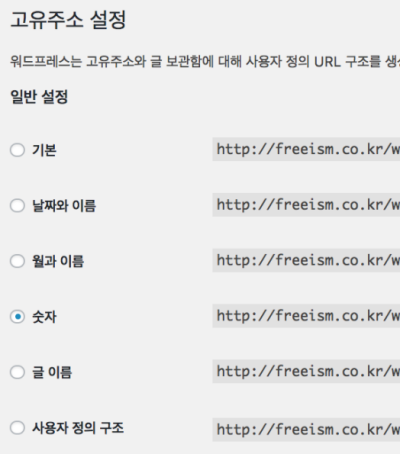

### 워드프레스 Permalinks 404 에러

워드프레스를 설치하면 기본 링크가 `http://localhost/?p=123`처럼 표시된다. ?p 처럼 파라미터로 받는 것보다는 restful한 느낌의 URL이 좋아서 Permalink 변경을 했더니 404 에러가 발생한다.



찾아보니 rewrite rule을 정의하는데 필요한 권한이 없어서 그런 것이었다. wordpress가 설치된 디렉토리에 .htaccess 파일에 아래처럼 넣고, `chmod 666 .htaccess`를 해주면 정상 동작하게 된다.

```bash
# BEGIN WordPress
<IfModule mod_rewrite.c>
    RewriteEngine On
    RewriteBase /
    RewriteRule ^index\.php$ - [L]
    RewriteCond %{REQUEST_FILENAME} !-f
    RewriteCond %{REQUEST_FILENAME} !-d
    RewriteRule . /index.php [L]
</IfModule>
# END WordPress
```

참고링크 : http://www.wpbeginner.com/wp-tutorials/how-to-fix-wordpress-posts-returning-404-error